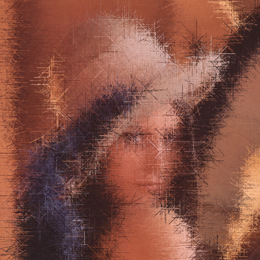
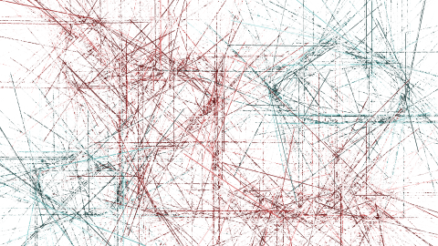
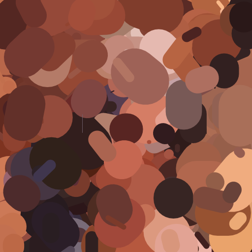

# Spiky Clouds
This is a filter that converts images into spiky images.
The image is created by drawing needles instead o pixels for each pixel value.

You get a crappy drawing of yours and transforms it into a spooky image:

|Original|Spiky|
|:-------------------------:|:-------------------------:|
|||
|||


## Installation
```bash
npm install spiky-clouds
```
### Dependencies
-   [Processing](https://processing.org/)
-   [XVFB](https://www.x.org/archive/X11R7.7/doc/man/man1/Xvfb.1.xhtml)

## Usage
```javascript
const sc = require("spiky-clouds")
sc(inputFile, outputFile, {seed: 42}).then(() => {
  console.log("done!");
});
```
### `sc(inputFile, outputFile[, opts])`:
Applies the filter in the `inputFile` generating the `outputFile`.
#### opts:
-   `seed`: Chooses the seed to be used for pseudo random number generation.
-   `minLength`: Chooses the minimum length of a needle. **Default: 0.00 (0%).**
-   `maxLength`: Chooses the maximum length of a needle. **Default: 0.02 (2%).**
-   `minWidth`: Chooses the minimum width of a needle. **Default: 0.0005 (0.05%).**
-   `maxWidth`: Chooses the maximum width of a needle. **Default: 0.001 (0.1%).**
-   `alpha`: Sets the value for the alpha channel for the needles. **Default: 255**
-   `rotation`: Chooses the mode in which the needles align. **Default:
    "min_gradient"**. Available modes:
    -   `min_gradient`: Draws the needles in the direction of the smallest gradient.
    -   `max_gradient`: Draws the needles in the direction of the largest gradient.
    -   `random`: Draws the needles randomly.
-   `angles`: Limits the available angles (in degrees) for the rotation modes, eg: `[0, 180]` - *horizontal needles*.
-   `verbose`: Shows the progress of the render.

The arguments `maxLength`, `minLength`, `maxWidth`, `minWidth`
Their value should be a float that represents a percentage of the perimeter, eg:
0.05 => 5% of the perimeter.

## Examples

|Mode|Lena|Logo|
|:-------------------------:|:-------------------------:|:-------------------------:|
|Original|||
|Minimum gradient rotation|||
|Maximum gradient rotation|||
|Random rotation|||
|Medium alpha|||
|Low alpha|||
|Big needle length|||
|Small needle length|||
|Medium needle width|||
|Big needle width|||
|Angles: 45°, 135°, -45° -135°|||


## License
This program is free software: you can redistribute it and/or modify it under the terms of the GNU General Public License as published by the Free Software Foundation, either version 3 of the License, or (at your option) any later version.

This program is distributed in the hope that it will be useful, but WITHOUT ANY WARRANTY; without even the implied warranty of MERCHANTABILITY or FITNESS FOR A PARTICULAR PURPOSE.  See the GNU General Public License for more details.

You should have received a copy of the GNU General Public License along with this program.  If not, see <http://www.gnu.org/licenses/>.
